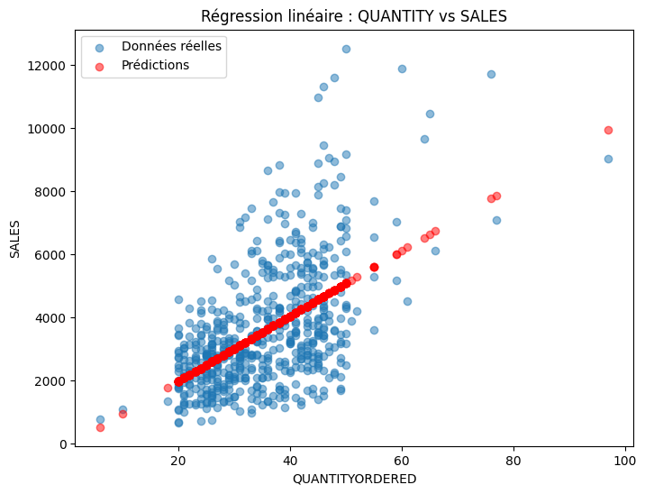

# 📊 Analyse des ventes – Projet Data Analyst
Par Jules Terlez

🎯 Objectif
Ce projet vise à analyser un dataset de ventes provenant d’un e-commerce fictif (Sample Sales Data).  
Les objectifs sont :  
- Explorer et nettoyer les données  
- Analyser les indicateurs clés : ventes, quantités, top produits  
- Créer des visualisations  
- Effectuer une première modélisation simple (régression)  
- Produire une synthèse Data Analyst claire et reproductible

---

# Structure du projet
├── data/                      
├── notebooks/                 
├── images/                    
└── README.md                   

---

# Outils utilisés
| Technologie              | Utilité                 |
| ------------------------ | ----------------------- |
| **Python**               | analyse et manipulation |
| **Pandas**               | traitement des données  |
| **NumPy**                | opérations numériques   |
| **Matplotlib**           | visualisation           |
| **SQLite**               | requêtes SQL            |
| **Scikit-learn**         | modèle de régression    |
| **Jupyter Notebook**     | exploration interactive |

---

# Analyse exploratoire (EDA)
Classement des produits les plus vendus 
|ID| PRODUCTLINE 	      |TotalSales |
|--|-------------------|-----------|
|0 | Classic Cars 	    |3919615.66 |
|1 | Vintage Cars 	    |1903150.84 |
|2 | Motorcycles 	    |1166388.34 |
|3 | Trucks and Buses 	|1127789.84 |
|4 | Planes 	          |975003.57  |
|5 | Ships 	          |714437.13  |
|6 | Trains 	          |226243.47  |
HISTOGRAMME DES VENTES PAR PRODUIT

---

# Modélisation (ML simple)
Régression linéaire pour prédire les ventes en fonction des quantités  
  

Erreur MAE (erreur moyenne absolue)

---

# 📝 Conclusion
- Les ventes sont fortement liées à la quantité commandée  
- Les catégories Classic Cars et Motorcycles dominent les revenus  
- Le modèle linéaire n’est qu’une première approche ; un modèle non linéaire pourrait améliorer les performances  
- Prochaines étapes : améliorer les features, ajouter un modèle RandomForest, exploration temporelle  
